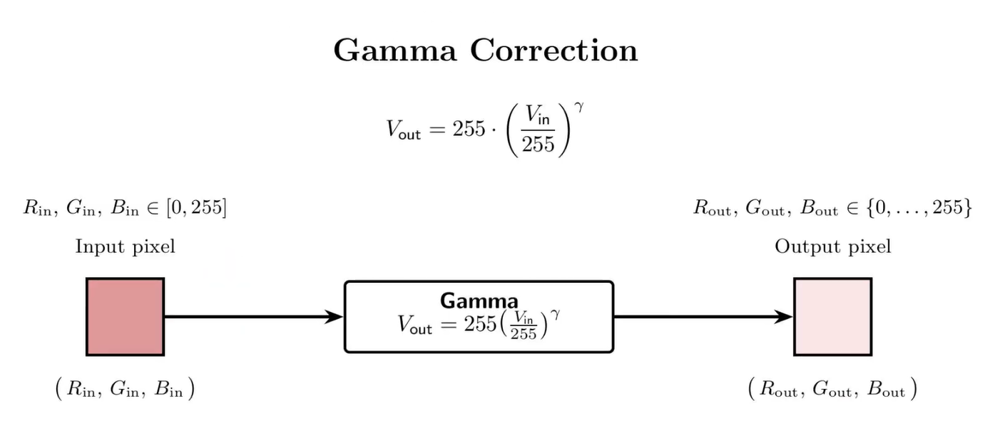

## Color Sensor with Micro:bit and Gamma Correction

In this project, we connected and programmed a micro:bit with the TCS34725 module, 
a sensor that detects colors by measuring the red, green, and blue channels reflected by an object. 
The goal is to read the RGB color values ​​of real-world objects and display them on an 8-LED NeoPixel LED strip.

To achieve realistic colors, we implemented a gamma correction function that adjusts the brightness and intensity 
of each channel, similar to modern displays.

---

### Materials
- BBC Micro:bit (v1 or v2)  
- Expansion board (I2C-compatible)  
- TCS34725 color sensor  
- NeoPixel LED strip  
- Jumper wires  
- USB cable and power supply  

---

### Gamma Correction Function

To make the color displayed on the LED strip look closer to reality, we apply a function called gamma correction. 
This function adjusts the intensity of each color channel so that the human eye perceives it more naturally. 
This is the same technique used by most screens to make colors look vibrant and realistic.
it transforms each RGB channel value (0–255) using the formula:

 

 

Typical **gamma** $(\gamma)$ values range between **2.2 and 2.6**.  
In this project, we use **$\gamma = 2.6$**. This value was the one that worked best for our project.

---

### Code (MakeCode)
This is the MakeCode program

This is the program in MakeCode. You will need to add two extensions: 
1. Envirobit (Just type envirobit in the extensions section)
2. Neopixel (Just type neopixel in the extensions section)

 

### Demo Video
<a href="https://www.youtube.com/watch?v=hVwhT0ojVrs" target="_blank">Watch the project on YouTube</a>

---

Category: **STEM Education | Micro:bit | Sensors**

